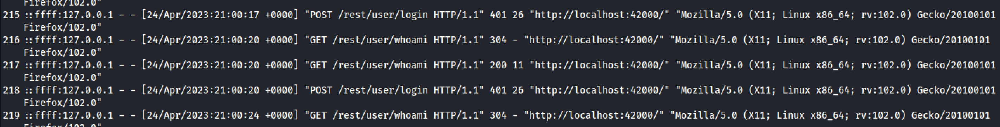
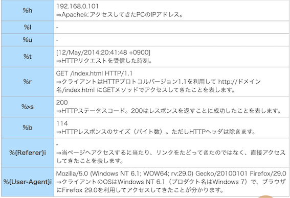
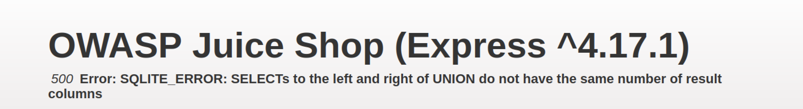
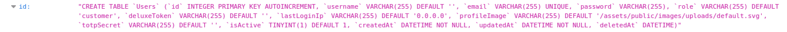

# A09: セキュリティログとモニタリングの失敗
---
# ログとは
> プログラムが実行された時に、あらかじめ設定された出力先へプログラムの情報を出力したもの。

[引用](https://qiita.com/sasakiki/items/7975bad6fb12fbd6158e)

---
# ログの種類

---
# ログの種類
* クライアントデバイス：取得すべきログは、そのOSから取得できる操作ログ、認証ログ、アプリから取得する操作ログ、通信ログなどがあり、それぞれデータのデータに対するアクセスログなどがあります。

* サーバー：取得できるログは、サーバOSから、Windowsのイベントログ、Linuxのsyslogやエラーログ、そしてミドルウェアやアプリケーションから、操作ログ、認証ログやアクセスログ、エラーログなどがあります。

[参考](https://www.esector.co.jp/log/log-type.html)

---
# ログの種類

---
# syslog
Syslogとは、Linuxサーバなど、システムの動きを記録したUNIX系（MACやLinux等）で取得するログで、Windows系のイベントログに相当します。

* メッセージ形式
`日付時刻 送信元 プロセス名[プロセスID]: [ID facility.priority] メッセージテキスト`

* 具体例
`Apr 10 21:25:21 systemwalker OD_start[1198]: [ID 855564 daemon.error] UX:OD: ERROR: od10921:ObjectDirector initialization time out.`

[参考](https://software.fujitsu.com/jp/manual/manualfiles/M080091/J2X17080/01Z200/moni04/moni0022.html)

---
# A09: セキュリティログとモニタリングの失敗とは

> This category is to help detect, escalate, and respond to active breaches. Without logging and monitoring, breaches cannot be detected. 

[OWASP Top 10](https://owasp.org/Top10/ja/A09_2021-Security_Logging_and_Monitoring_Failures/)より引用

---
# 具体例
* ログイン、失敗したログイン、重要なトランザクション(単一の処理を複数回行ったもの。SQLなどでは複数の処理を一文で行うこと)などの監査可能なイベントがログに記録されていない。

* 警告とエラーが発生してもログメッセージが生成されない、または不十分、不明確なメッセージが生成されている。

---
# 具体例２
* ログがローカルにのみ格納されている。
（→ログをどこに格納するのか？DBだと考えた）

* アラートの適切なしきい値とレスポンスのエスカレーションプロセスが整えられていない、または有効ではない。

---
# 想定される被害
* 不法なアクセス侵害に気づかず、被害が長期化する
* 不適切なメッセージを生成することにより、情報の漏洩を引き起こす 
* 被害に遭った場合、加害者を特定できない。また、そのような抑止力がない。
---
# OWASP juice shop における実践
* アクセスログの所得
    * Login Support Account
    * Acess Log
* データベースにログが保管されているかの確認

---
# アクセスログの所得
1. まず、Login Support Accountをクリアし、supportアカウントでログインする。（ヒントを見ると、supportアカウントからしかアクセスできないと書いてある）

2. その状態で`http://localhost:3000/support/logs`にアクセスするとログファイルが置いてあるので、所得することができる。
（Dirbuster、Gobuster、またはその他のディレクトリ列挙ツールを使用して再帰的なブルート フォース ディレクトリ検索を行うと、「/support/logs」という名前のディレクトリがあることがわかります。）ともある。

[参考](https://curiositykillscolby.com/2020/12/13/pwning-owasps-juice-shop-pt-48-access-log/)

---
# ログの解析
アカウントにログインしようしてパスワードを何回か間違えている時のアクセスログ

(::ffff:となっているのは、IPv4射影アドレスといって、IPv4のアドレスをIPv6のフォーマットで表現しているから)

---
# アクセスログの見方
* 例
`192.168.0.101 - - [12/May/2014:20:41:48 +0900] "GET /index.html HTTP/1.1" 200 114 "-" 
"Mozilla/5.0 (Windows NT 6.1; WOW64; rv:29.0) Gecko/20100101 Firefox/29.0"`

--- 
# データベースにログが保管されているかの確認
SQLインジェクションを利用して、データベースにアクセスし重要なアクセスログ等が保存されているかを確認する

---
# データベースにログが保管されているかの確認
1. 以前使用した`http://localhost:3000/rest/products/search?q=))'--`を変えてデータベースの中身を見たい

2. `UNION SELECT * FROM sql_master`を追加してみてみる

3. すると、以下のような画像が表示される
 

---
# データベースにログが保管されているかの確認
4. おそらく、columnの数を合わせる必要がありそうなので、`Busckets`tableのcolumnの数９に合わせて`http://localhost:3000/rest/products/search?q=))'--　UNION SELECT name,2,2,2,2,2,2,2,2 FROM sqlite_master WHERE type = "table"--`としてみると、うまくいった

5. 試しに、UsersのDBを見てみると、`lastloginIp`,`UpdateAt`などが記録されている。ただ、アクセスログや認証ログ等の記録はされていなかった。（→DBにログは残さない？）

---
# 対策
* ログイン、アクセス制御の失敗、サーバサイドの入力検証の失敗を全てログとして記録するようにする。 ログは、不審なアカウントや悪意のあるアカウントを特定するために十分なユーザコンテキストを持ち、 後日、フォレンジック分析を行うのに十分な期間分保持するようにする。
(フォレンジック調査とは、法的な証拠を見つけるための調査のため、「不正アクセスがされていないか」「悪意を持って情報が改ざんされていないか」などを調べること)

---
# 対策
* 不審なアクセスログやクリティカルなエラーログなどを適切に選択して記録をしておく。

---
# メモ
* DBのトランザクションログを利用してロールバックを行う
* DBにログを保管するのは一般的ではない？
* 
---
# 参考文献
* https://owasp.org/Top10/ja/A09_2021-Security_Logging_and_Monitoring_Failures/
* https://thinline196.hatenablog.com/entry/2019/08/09/005727
* https://qiita.com/sasakiki/items/7975bad6fb12fbd6158e
* https://software.fujitsu.com/jp/manual/manualfiles/M080091/J2X17080/01Z200/moni04/moni0022.html
* https://curiositykillscolby.com/2020/12/13/pwning-owasps-juice-shop-pt-48-access-log/
